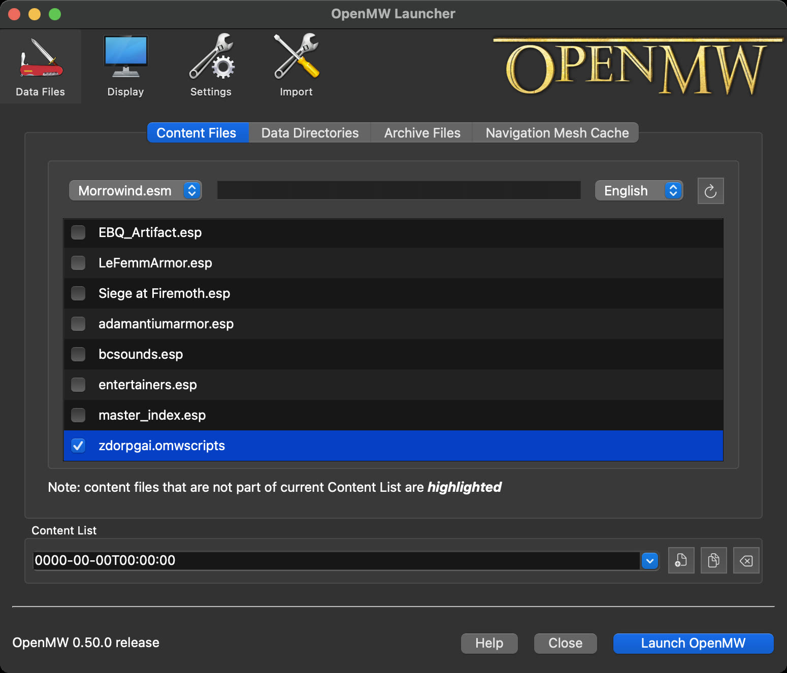
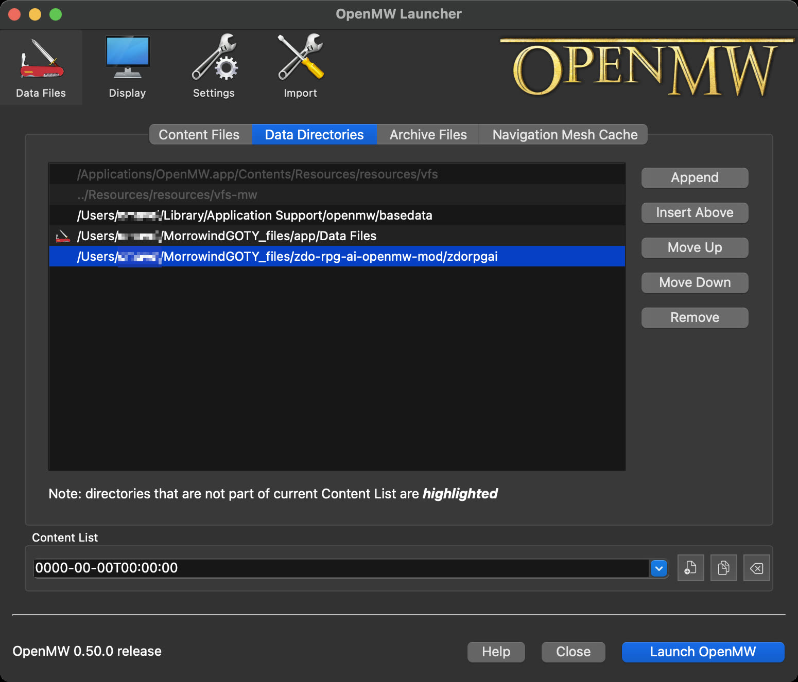

# Zdo RPG AI - OpenMW Mod

Integration of Zdo RPG AI system into OpenMW.


# Instructions

## Simple deployment example

The expected setup is:

- the [Server](https://github.com/drzdo/zdo-rpg-ai) runs on a separate machine
- OpenMW runs on the game machine
- the [Client](https://github.com/drzdo/zdo-rpg-ai) runs on the game machine and bridges this mod to the server

1. Add the mod to `openmw.cfg`.

On macOS this file is usually:

```
~/Library/Preferences/openmw/openmw.cfg
```

Add these lines:

```ini
data="/path/to/zdo-rpg-ai-openmw-mod/zdorpgai"
content=zdorpgai.omwscripts
```

2. Configure and run the [Client](https://github.com/drzdo/zdo-rpg-ai) on the game machine.

The Client setup and full config reference are documented in the main project README:

- https://github.com/drzdo/zdo-rpg-ai#client-configuration

3. Start OpenMW and load the game.

The new resources from this mod should be visible in the Launcher window before you start the game.

<p>
	
	
</p>

If everything is configured correctly:

- in the client log, you should see `Connected to server`
- in the client log, you should see `Connected to mod`
- in game, the expected confirmation is `ZdoRPG connected`
